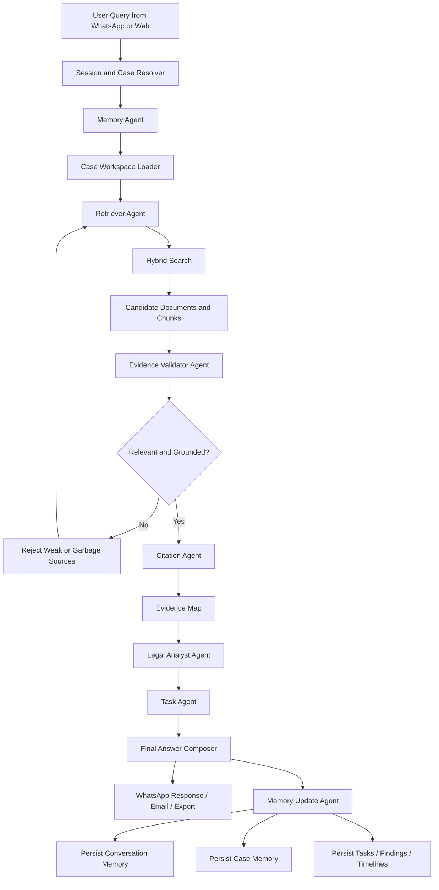
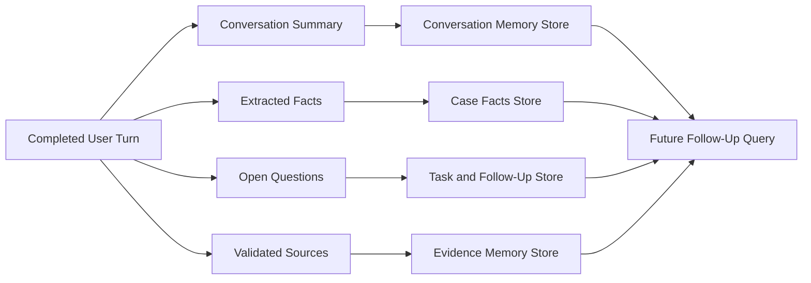
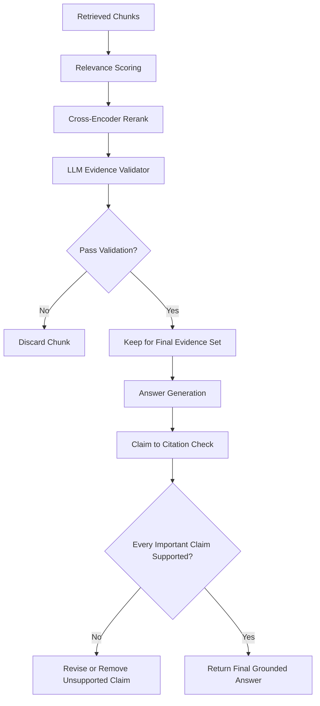

# Legal AI Project

## Overview
This project is a legal-document RAG system with a WhatsApp interface.

It has two running services:

- `rag_backend.py`: FastAPI backend for retrieval, answer generation, short links, and email sharing
- `whatsapp_bot.py`: FastAPI webhook service for GreenAPI WhatsApp integration

Main capabilities:

- Search across external and internal legal document corpora
- Generate grounded answers with source links
- Return short source URLs instead of long Azure SAS URLs
- Share answers by email
- Support reply-aware follow-ups in WhatsApp
- Support voice message transcription

## High-Level Architecture

```text
WhatsApp User
   |
   v
GreenAPI
   |
   v
whatsapp_bot.py  ----------------------------+
   |                                         |
   | HTTP                                    | in-memory conversation state
   v                                         |
rag_backend.py                               |
   |                                         |
   +--> Azure AI Search                      |
   +--> Azure OpenAI                         |
   +--> Azure Blob Storage                   |
   +--> Gmail SMTP / SMTP provider           |
```

## Main Runtime Components

### 1. `rag_backend.py`
Core backend service.

Responsibilities:

- Builds embeddings with Azure OpenAI
- Retrieves from Azure AI Search
- Re-ranks results with a cross-encoder
- Generates final answers
- Generates short redirect links for sources
- Sends shared answers by email through SMTP

Current public endpoints:

- `GET /health`
- `GET /s/{token}`: resolve short-link token and redirect to fresh blob URL
- `POST /search`: direct search
- `POST /chat`: main RAG answer endpoint
- `POST /share/email`: send answer by email
- `POST /webhook/whatsapp`: placeholder webhook endpoint on backend side

Important current behavior:

- Uses dual source handling:
  - external: `legal-documents`
  - internal: `legal-documents-internal`
- Builds user-facing short links via backend redirect instead of exposing long SAS URLs
- Uses SMTP instead of ACS/Resend for email sending
- Accepts preformatted email body from WhatsApp service so email can mirror WhatsApp response layout

### 2. `whatsapp_bot.py`
GreenAPI webhook service for WhatsApp.

Responsibilities:

- Receives incoming GreenAPI webhooks
- Filters allowed groups / DMs
- Detects mentions
- Handles text and voice messages
- Sends user query to backend
- Formats backend response for WhatsApp
- Tracks sent bot message IDs for reply-aware follow-ups
- Supports reply-based email sharing

Current public endpoints:

- `GET /health`
- `POST /webhook/greenapi`
- `GET /webhook/greenapi`

Important current behavior:

- Group-restricted by `ALLOWED_GROUP_ID`
- DM-restricted by `ALLOWED_DM_PHONES`
- Bot ignores its own messages using `BOT_PHONE`
- Stores all sent WhatsApp message IDs for multi-part reply tracking
- Replying to any split message can reuse that chunk as follow-up or email context
- Multi-part answers are stored chunk-by-chunk, not only as one full response

### 3. Azure Blob Storage
Current logical containers:

- `legal-documents`: external documents
- `legal-documents-internal`: confidential/internal documents
- `short-links`: mapping store for backend-generated short URLs

Short-link flow:

1. Backend stores token metadata in `short-links`
2. WhatsApp/email shows `PUBLIC_BASE_URL/s/{token}`
3. User opens short link
4. Backend generates fresh blob URL and redirects

### 4. Azure AI Search
Used as primary retrieval layer.

Current backend logic uses:

- keyword search
- vector search
- source-aware metadata
- cross-encoder reranking

The codebase includes isolated search/retrieval logic for internal/external sources and answer-generation nodes around that retrieval.

### 5. Azure OpenAI
Used for:

- query understanding
- answer generation
- routing / conversation classification in WhatsApp bot
- embeddings
- transcription client integration support on WhatsApp side

### 6. SMTP Email Provider
Current email sending path is SMTP.

Typical current use:

- Gmail SMTP
- sender mailbox used directly as `SMTP_SENDER_EMAIL`

The old ACS path is no longer the active email delivery path.

## Data and Processing Flow

### Document Ingestion
Documents are uploaded into Azure Blob Storage.

Typical sources:

- external legal corpus
- internal confidential legal corpus

### OCR / Text Extraction
Relevant scripts:

- `ocr_to_blob.py`
- `ocr_internal.py`
- `process_all_formats.py`
- `retry_failed.py`

These produce extracted text under blob paths used later for indexing.

### Indexing
Relevant scripts:

- `index_to_search.py`
- `index_internal.py`
- `recreate_index.py`
- supporting repair / audit scripts such as `fix_classification.py`, `audit_data.py`

The index stores:

- chunked text
- metadata
- blob path
- source container
- vectors

### Query Flow

```text
User message
-> GreenAPI webhook
-> whatsapp_bot.py
-> mention / reply / email / voice handling
-> rag_backend.py /chat
-> retrieval + rerank + answer generation
-> formatted WhatsApp response
-> optional email via /share/email
```

## Current Reply-Aware WhatsApp Behavior

The bot supports reply-context handling.

What currently works:

- User replies to a bot answer and asks a follow-up
- User replies to any split part of a long bot answer
- User replies and asks to email the replied content
- User can ask for specific statements/paragraph numbers within the replied chunk

Current design details:

- all sent message IDs are tracked
- split messages are stored with:
  - full answer
  - exact chunk text
  - query
  - sources
- email requests can use replied chunk text instead of always sending the full answer

## Email Flow

Current email flow is:

1. User asks bot to send an answer by email
2. `whatsapp_bot.py` detects the email request
3. It resolves payload from:
   - replied bot message context, or
   - latest stored answer
4. It calls backend `POST /share/email`
5. Backend sends email via SMTP

Current behavior:

- If user asks to email but does not include recipient email, bot prompts for the address
- Email body can reuse WhatsApp-style formatted content

## Formatting Behavior

Current WhatsApp output is intentionally plain-text friendly.

Recent formatting changes:

- removed markdown-style emphasis such as `*bold*` and `_italic_` from response body formatting
- source blocks are emitted as plain text
- email body can now reuse the same formatted output style as WhatsApp

## Important Files

### Backend / Core

- `rag_backend.py`
- `prompts.py`
- `audit_data.py`
- `fix_classification.py`

### WhatsApp Layer

- `whatsapp_bot.py`

### OCR / Indexing

- `ocr_to_blob.py`
- `ocr_internal.py`
- `process_all_formats.py`
- `retry_failed.py`
- `index_to_search.py`
- `index_internal.py`
- `recreate_index.py`

### Testing / Verification / Notes

- `Test/answer_verification.txt`
- `.env`
- `.env.new`
- `requirements.txt`

## Environment Variables

### Backend (`rag_backend.py`)

Core retrieval / Azure:

- `SEARCH_ENDPOINT`
- `SEARCH_KEY`
- `SEARCH_INDEX`
- `SEARCH_INDEX_EXTERNAL`
- `SEARCH_INDEX_INTERNAL`
- `MIN_SEARCH_SCORE`
- `CROSS_ENCODER_MIN_SCORE`
- `OPENAI_ENDPOINT`
- `OPENAI_KEY`
- `OPENAI_CHAT_DEPLOYMENT`
- `OPENAI_EMBEDDING_DEPLOYMENT`
- `CONTAINER_SAS_URL`
- `INTERNAL_CONTAINER_SAS_URL`

Short links:

- `PUBLIC_BASE_URL`
- `SHORT_LINKS_CONTAINER`

SMTP:

- `SMTP_HOST`
- `SMTP_PORT`
- `SMTP_USERNAME`
- `SMTP_PASSWORD`
- `SMTP_SENDER_EMAIL`
- `SMTP_USE_TLS`

Legacy / no longer active primary email path:

- `ACS_CONNECTION_STRING`
- `ACS_SENDER_EMAIL`
- `RESEND_API_KEY`
- `RESEND_SENDER_EMAIL`

### WhatsApp Service (`whatsapp_bot.py`)

GreenAPI:

- `GREENAPI_URL`
- `GREENAPI_INSTANCE_ID`
- `GREENAPI_TOKEN`
- `ALLOWED_GROUP_ID`
- `BOT_NAME`
- `BOT_PHONE`
- `ALLOWED_DM_PHONES`

Routing / OpenAI / backend access:

- `RAG_BACKEND_URL`
- `OPENAI_ENDPOINT`
- `OPENAI_KEY`
- `OPENAI_CHAT_DEPLOYMENT`

Persistent Memory (Cosmos DB):

- `MEMORY_BACKEND` (set to `cosmos` to enable, default: `inmemory`)
- `COSMOS_ENDPOINT`
- `COSMOS_KEY`
- `COSMOS_DATABASE` (default: `legal-assistant`)

Voice:

- `AUTO_PROCESS_AUDIO`
- Whisper/OpenAI-related values if configured in environment

## Current Operational Notes

### 1. Cross-encoder startup can be heavy
`rag_backend.py` loads a Hugging Face cross-encoder. On fresh startup this may:

- download model files
- slow startup
- cause transient health/startup issues if the host is impatient

### 2. Short links are backend-owned
User-facing links are not raw Azure SAS URLs anymore. They are backend redirect links.

### 3. SMTP is currently the working email channel
SMTP with Gmail app password is the current working path.

### 4. WhatsApp instance strategy
For testing new webhook behavior safely, use a separate GreenAPI instance with a separate WhatsApp number and separate test group.

## Current Known Functional Areas

Working / implemented:

- RAG answers from WhatsApp
- short source URLs
- SMTP email sending
- reply-based email actions
- chunk-aware multi-message reply context
- WhatsApp plain-text response formatting

Areas that are sensitive / operationally tricky:

- heavy backend startup because of cross-encoder model load
- GreenAPI reply payload shape differences
- Azure deployment / restart timing
- WhatsApp split-message context behavior for novice users

## Suggested Research Topics

If you want to continue researching improvements, these are the highest-value directions:

### Retrieval / Relevance

- source-aware reranking
- confidence scoring before final answer
- contradiction-analysis prompting for legal workflows
- improved retrieval for exact numeric facts and quoted statements

### Operations

- lazy-loading cross-encoder on first request
- persistent model cache for app restarts
- health-check hardening
- staging vs production GreenAPI setup

### WhatsApp UX

- better parsing of novice follow-up requests
- chunk-specific reference extraction
- section-aware email/export actions
- explicit command patterns for users who reply ambiguously

### Document Intelligence

- better OCR normalization for multilingual legal docs
- metadata classification fixes
- audit pipeline for missing/incorrect source metadata

## Proposed Agent Flow

This is the recommended multi-agent flow for the lawyer-assistant version of the project.



### Agent Responsibilities

#### 1. Session and Case Resolver
- identify user
- identify active case
- determine whether request belongs to an existing case thread or a new matter

#### 2. Memory Agent
- load recent conversation memory
- load persistent case facts
- load prior contradictions, timelines, witness notes, and unfinished tasks

#### 3. Retriever Agent
- generate search variants
- run hybrid retrieval across indexes and metadata filters
- collect top candidate chunks and documents

#### 4. Evidence Validator Agent
- remove irrelevant or weak sources
- ensure only grounded evidence survives
- prevent garbage sources from reaching final answer generation

#### 5. Citation Agent
- attach exact support for each factual finding
- map claims to specific source passages
- enforce citation-backed output

#### 6. Legal Analyst Agent
- compare statements
- detect contradictions and factual inconsistencies
- build legal reasoning structures such as chronology, witness credibility issues, and document mismatches

#### 7. Task Agent
- execute lawyer-style work requests
- examples:
  - draft chronology
  - extract contradictions
  - prepare witness notes
  - share by email
  - explain a paragraph
  - isolate statements 1 and 3

#### 8. Final Answer Composer
- produce user-facing response
- keep answer grounded in validated evidence only
- adapt response format for WhatsApp, email, or future UI

#### 9. Memory Update Agent
- store what was learned in the turn
- update case summary, facts, open questions, and action history
- make the next follow-up work even days later

## Proposed Long-Term Memory Flow



## Proposed Validation Gate



## Current Service Ports

- backend: `8000`
- WhatsApp bot: `8001`

## Minimal Run Order

1. Start `rag_backend.py`
2. Start `whatsapp_bot.py`
3. Point GreenAPI webhook to WhatsApp bot service
4. Ensure Azure Search, Blob, OpenAI, and SMTP env vars are valid

## Summary

This codebase is now a two-service legal AI system with:

- Azure-based retrieval and storage
- WhatsApp interaction via GreenAPI
- backend-managed short links
- SMTP-based answer sharing
- reply-aware, chunk-aware follow-up handling

The most important current files for future work are:

- `rag_backend.py`
- `whatsapp_bot.py`
- `prompts.py`
- `requirements.txt`
- `.env`
